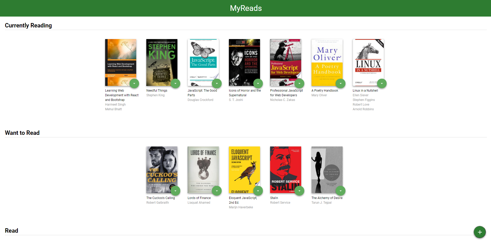
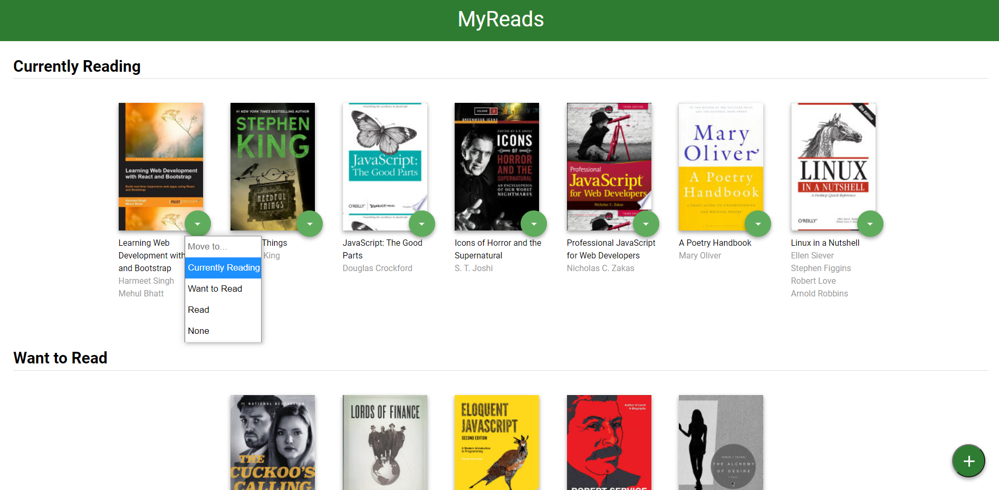
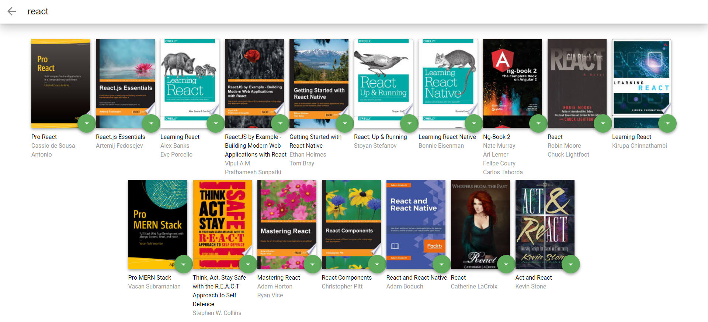

# MyReads App

MyReads app is a bookshelf app that allows you to select and categorize books you have read, are currently reading, or want to read. The app emphasizes using React and provides an API server and client library to persist information as you interact with the application.

## How to use the app

* clone the project with `git clone https://github.com/habibayassin/myreads-react.git`
* install all project dependencies with `npm install`
* start the development server with `npm start`

## App View

The app has a main page which contains the different book shelves and the books that belong to them and an add button that allows you to search for more books and add them to your shelves.

### Book options
Each book has an option for moving it from one shelf to another or removing it from the set of shelves.

### Search
The backend API uses a fixed set of cached search results and is limited to a particular set of search terms, which can be found in [SEARCH_TERMS.md](SEARCH_TERMS.md). That list of terms are the _only_ terms that will work with the backend, so don't be surprised if your searches for Basket Weaving or Bubble Wrap don't come back with any results.

## Create React App

This project was bootstrapped with [Create React App](https://github.com/facebookincubator/create-react-app). You can find more information on how to perform common tasks [here](https://github.com/facebookincubator/create-react-app/blob/master/packages/react-scripts/template/README.md).
